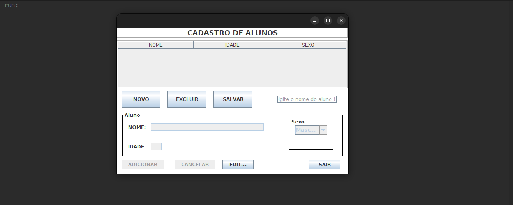
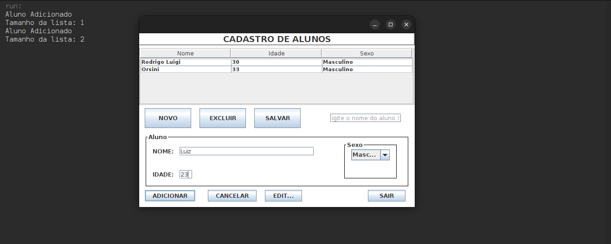
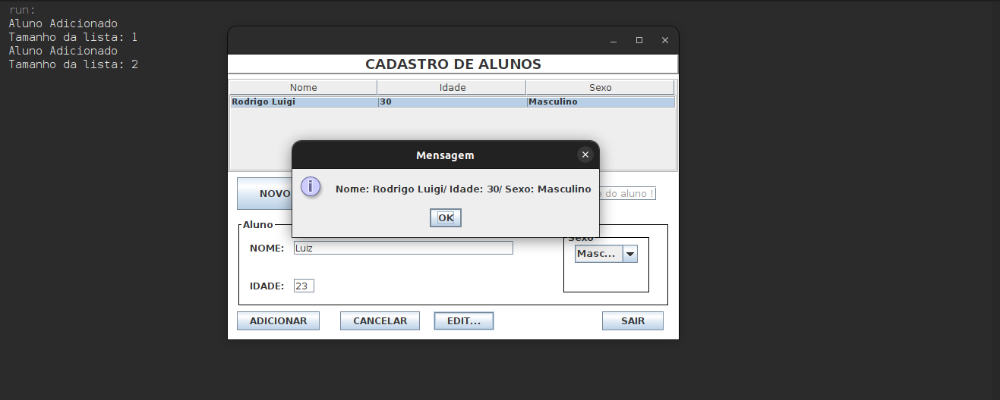

# <h1 id="top" align="center">Gerenciador de Alunos 👨‍🎓</h1>

<p align="center">
  <a href="#sobre">Sobre</a> &#xa0; | &#xa0; 
  <a href="#gear-features">Features</a> &#xa0; | &#xa0;
  <a href="#books-bibliotecas">Tecnologias</a> &#xa0; | &#xa0;
  <a href="#-requisitos">Requisitos</a> &#xa0; | &#xa0;
  <a href="#checkered_flag-iniciando">Iniciando</a> &#xa0; | &#xa0;
  <a href="https://github.com/RodrigoLuigi" target="_blank">Author</a>
</p>

<br>

## Screenshots

<div align="center">
  
  
  
</div>

<br><hr>

##  _**O que desenvolvemos neste Projeto?**_

📌 Aplicação para manipulação de dados inseridos em uma tabela através de um formulário e salva em arquivo de texto(.txt).

Desenvolvido utilizando programação orientada a objetos , no qual foi criado classe , constructor e funções 
  
Techs: **JAVA**

## :gear: Features

:heavy_check_mark: Cadastro de aluno\
:heavy_check_mark: Deletar aluno\
:heavy_check_mark: Editar aluno\
:heavy_check_mark: Listar alunos\
:heavy_check_mark: Listar aluno pelo id\
:heavy_check_mark: Salvar Lista de alunos em arquivo .txt

## :books: Bibliotecas

_**As seguintes bibliotecas foram utilizadas neste projeto:**_

- [Java](https://docs.oracle.com/en/java/)
- [Swing GUI Builder](https://docs.oracle.com/javase/tutorial/uiswing/)

## 📝 Requisitos

- [Git](https://git-scm.com)
- [JDK](https://www.oracle.com/br/java/technologies/downloads/)
- [NetBeans](https://netbeans.apache.org/front/main/index.html)

## :checkered_flag: Iniciando

#### Inicializando aplicação Front-end

```bash
# Clone este projeto
$ git clone https://github.com/RodrigoLuigi/gerenciador-de-alunos.git

# Acesse o projeto
$ cd gerenciador-de-alunos

# Execute o projeto pelo NetBeans
```

&#xa0;

_**Feito por <a href="https://github.com/RodrigoLuigi" target="_blank">Rodrigo Luigi</a>**_ 👨‍🚀

<a href="#top">Back to top</a>